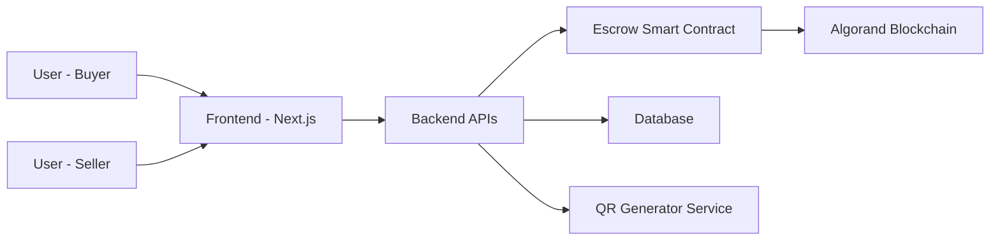
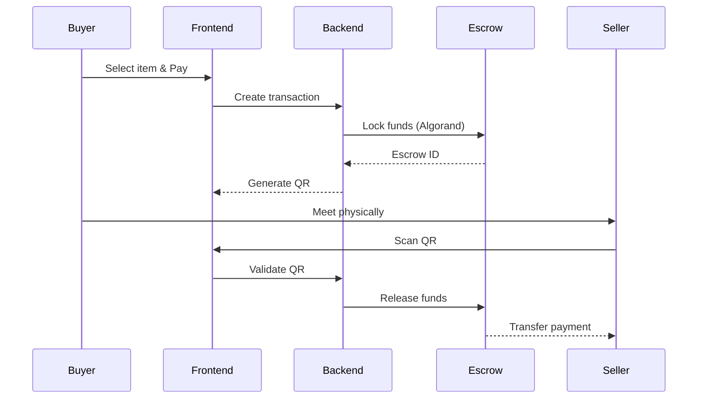
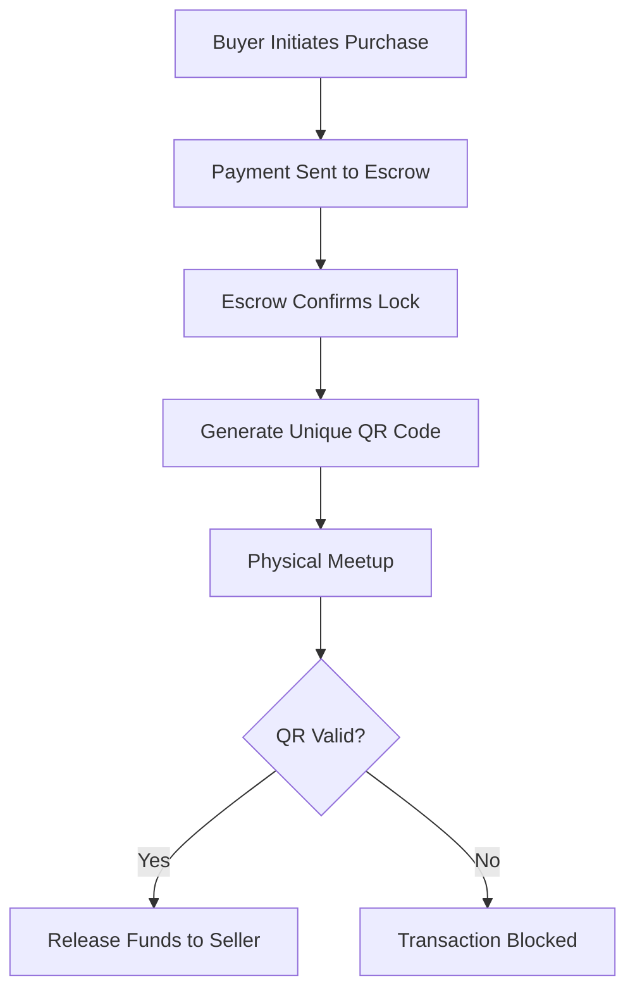
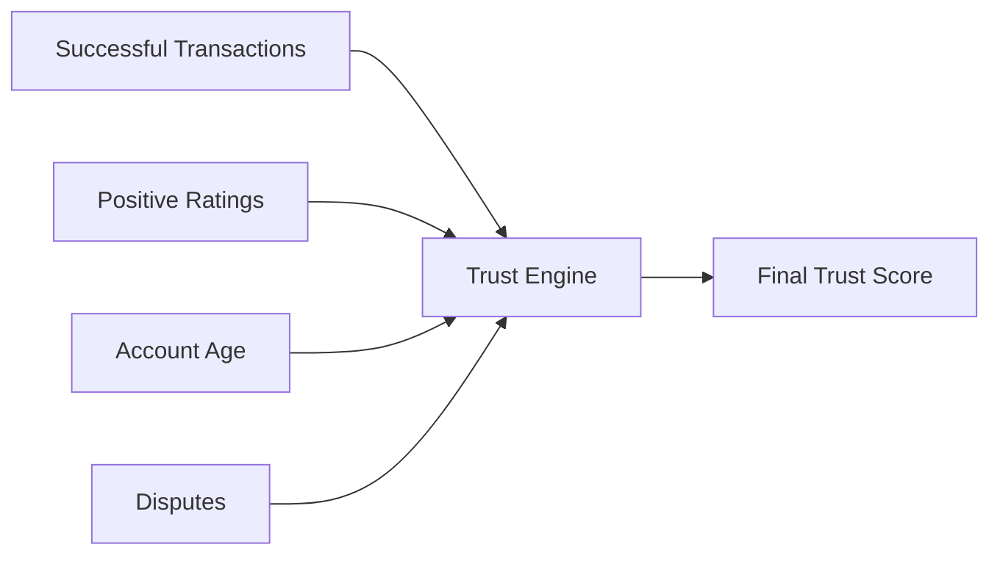

# 🛍️ Vouch – The Student Marketplace (Powered by Algorand)

> A secure, campus-focused peer-to-peer marketplace with escrow protection and QR-based handoff verification — powered by the Algorand blockchain.

Live Demo Link: https://9000-firebase-studio-1770477116255.cluster-aic6jbiihrhmyrqafasatvzbwe.cloudworkstations.dev 

---

# 📌 Overview

**Vouch** is a student-only digital marketplace designed to eliminate fraud in campus buying and selling.

Unlike traditional marketplaces, Vouch uses:

* 🔐 Blockchain-backed escrow (Algorand)
* 📱 QR-based physical exchange validation
* ⭐ Trust score & reputation system
* 🏆 Reward economy for active users
* 📊 Admin monitoring & analytics dashboard

The goal is simple:

> No scams. No fake payments. No unsafe exchanges.

---

# 🚀 Core Features

## 1️⃣ Secure Escrow System (Algorand-Based)

Funds are locked in a smart escrow wallet until both buyer and seller confirm the exchange.

✔ Buyer pays → Funds locked on Algorand
✔ QR generated for transaction
✔ Seller scans QR during meetup
✔ Funds released automatically

---

## 2️⃣ QR-Based Transaction Validation

Every transaction generates a unique QR containing:

* Transaction ID
* Escrow reference
* Buyer ID
* Seller ID
* Timestamp

This ensures physical exchange verification before fund release.

---

## 3️⃣ Trust & Reputation Engine

Users earn trust points based on:

* Successful transactions
* Positive ratings
* Account age
* Dispute-free history

Higher trust = Higher visibility.

---

## 4️⃣ Reward Economy

Users earn platform credits for:

* Completing transactions
* Referring students
* Maintaining high trust

Credits can be used for:

* Promoted listings
* Fee discounts

---

## 5️⃣ Admin Dashboard

Admins can:

* Monitor transactions
* View dispute logs
* Track user activity
* Freeze suspicious accounts

---

# 🏗️ System Architecture



---

# 🔄 Complete Transaction Flow



---

# 💰 Escrow Logic Flowchart



---

# 🧠 Trust Score Calculation Model



---

# 🗂️ Project Structure

```
Vouch/
│
├── src/
│   ├── components/      # UI Components
│   ├── pages/           # Application Routes
│   ├── api/             # Backend API Routes
│   ├── services/        # Escrow + Blockchain Logic
│   └── utils/           # Helper functions
│
├── docs/                # Diagrams & documentation
├── public/              # Static assets
├── package.json
└── next.config.ts
```

---

# 🔐 Why Algorand?

Algorand provides:

* ⚡ High-speed finality (~4 seconds)
* 💸 Extremely low transaction fees
* 🔒 Secure smart contracts
* 🌍 Energy-efficient blockchain

This makes it ideal for micro-transactions in a student economy.

---

# ⚙️ Tech Stack

| Layer      | Technology           |
| ---------- | -------------------- |
| Frontend   | Next.js + TypeScript |
| Styling    | Tailwind CSS         |
| Backend    | API Routes           |
| Blockchain | Algorand             |
| Database   | Firestore / NoSQL    |
| QR System  | Dynamic QR Generator |

---

# 🛡️ Security Model

✔ Escrow-based smart contract logic
✔ QR validation before release
✔ Server-side transaction verification
✔ Admin monitoring
✔ Dispute handling system

---

# 📈 Scalability Design

The system supports scaling by:

* Stateless backend APIs
* Blockchain-based payment handling
* Cloud-hosted database
* Modular microservice-ready structure

---

# 🔮 Future Enhancements

* 📱 Mobile app version
* 🧾 On-chain transaction history viewer
* 🧠 AI fraud detection engine
* 🎓 University email verification integration
* 💳 Native Algorand wallet integration

---

# 🎯 Problem Solved

Campus marketplaces often suffer from:

❌ Fake UPI screenshots
❌ Non-payment after handoff
❌ Anonymous scammers

Vouch eliminates these through blockchain-backed escrow and QR confirmation.

---

# 🏁 Conclusion

Vouch is not just a marketplace.

It is a **trust infrastructure for student commerce**, built on the reliability of Algorand and modern full-stack architecture.

---

# 📜 License

MIT License

---

# 💡 Built For

Hackathons • Campus Deployments • Web3 Innovation • Secure Peer Commerce

---

If you like this project, consider ⭐ starri
